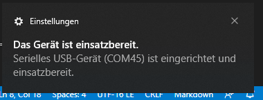

# PlatformIO example with latest libopencm3 version

Literally just the [cdcacm.c](https://github.com/libopencm3/libopencm3-examples/blob/master/examples/stm32/f1/stm32-maple/usb_cdcacm/cdcacm.c) example used with the newest libopencm3 framework version and compiler version.

For repackaging libopencm3, a Linux machine was used, https://github.com/libopencm3/libopencm3 was cloned, `make` was executed, the `.a` files in `lib/` were deleted (PlatformIO compiles everything from source), then a `package.json` was added based on the previous one, but with updated version info (see [`package.json`](https://github.com/maxgerhardt/pio-libopencm3-repackage/blob/main/package.json)). The thing was then uploaded to a repo (https://github.com/maxgerhardt/pio-libopencm3-repackage) and pointed to by 

```ini
platform_packages = 
   framework-libopencm3@https://github.com/maxgerhardt/pio-libopencm3-repackage.git
```

That's literally it. 

For upgrading the compiler version, the available versions for [toolchain-gccarmnoneeabi](https://api.registry.platformio.org/v3/packages/platformio/tool/toolchain-gccarmnoneeabi) were inspected and using semantic versioning, the version expression `~1.90301.0` is used to select a GCC 9.3.1 compiler version, again using an extended `platform_packages` command.

One can also use a local toolchain folder, given that it has a `package.json` in it akin to the one in PlatformIO packages (see `<user home>/.platformio/packages/toolchain-gccarmnoneeabi/package.json`) and can then be pointed to using `

```ini
platform_packages = 
   toolchain-gccarmnoneeabi@file://<path to toolchain folder here>
```

## What does this example do? 

It creates a USB CDC (virtual serial port). 

Flash the firmware onto a Bluepill, e.g. using an ST-Link, and plug connect a micro-USB cable to the Bluepill. 

You will see..




A new COM port upon plugging in the device.